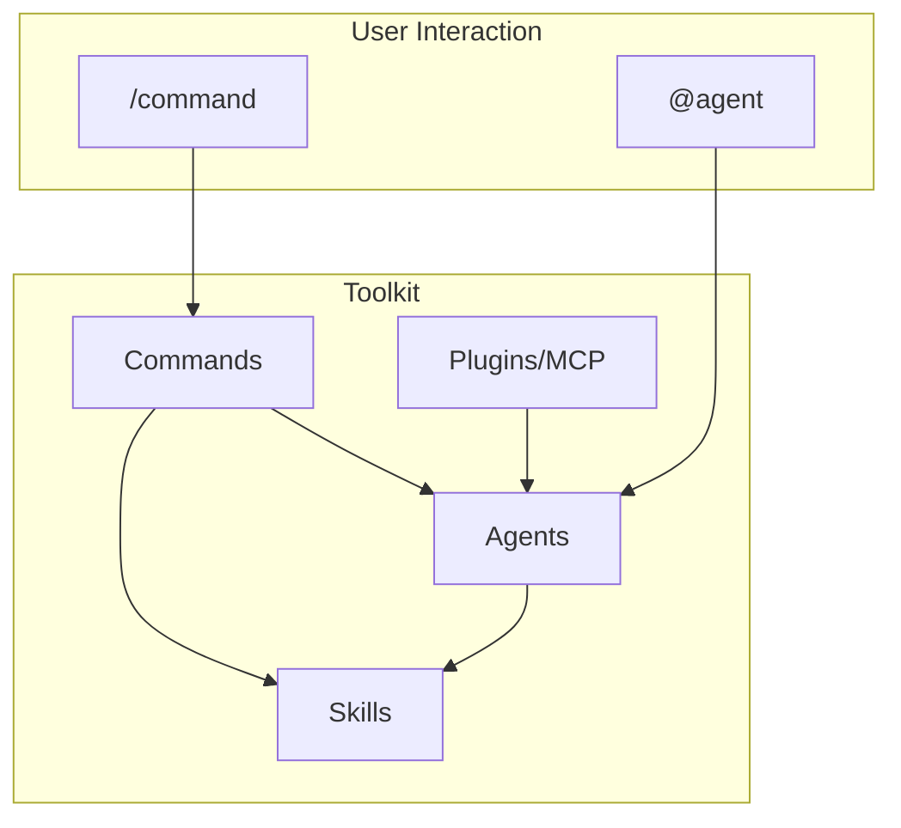

# Claudekit

Personal Claude Code plugin marketplace. Agents, skills, commands, and MCP plugins.

## Installation

```bash
# Via plugin install
claude plugin install jjeremycai/claudekit

# Or manually
git clone https://github.com/jjeremycai/claudekit.git
claude --plugin-dir /path/to/claudekit
```

## Architecture



## Agents

Specialized agents for different task types.

| Agent | Modes | Description |
|-------|-------|-------------|
| **code-reviewer** | REVIEW, AUDIT | Code review (changes) and deep codebase audits |
| **engineer** | IMPLEMENT, FIX, DEBUG, INVESTIGATE | Implementation, fixes, debugging |
| **writer** | WRITE, UPDATE | Technical documentation |
| **frontend-engineer** | — | High-quality, distinctive UI |
| **auth-expert** | — | Auth debugging (PKCE, OAuth, sessions, cookies) |
| **vercel-debugger** | — | Vercel build/deployment failures |
| **extract-pattern** | — | Extract patterns from GitHub repos |
| **ashby-recruiter** | — | Recruiting pipeline management |
| **missive-assistant** | — | Missive inbox management |

## Skills

Skills provide specialized knowledge and workflows.

### Code Quality

| Skill | Trigger | Description |
|-------|---------|-------------|
| `/review` | "review code", "check for bugs" | 3x parallel code reviewers |
| `/fix` | "fix issues", "apply fixes" | Auto-fix review findings |
| `cto-audit` | — | Deep architecture audit methodology |
| `react-best-practices` | — | React/Next.js performance patterns |
| `web-interface-guidelines` | — | Accessibility and UX best practices |

### Documentation

| Skill | Trigger | Description |
|-------|---------|-------------|
| `/docs-write` | "write docs", "create README" | Create comprehensive documentation |
| `/docs-update` | "update docs", "sync docs" | Update docs to match code |
| `/state-diagram` | "create state diagram" | Generate Mermaid state diagrams |

### Development

| Skill | Trigger | Description |
|-------|---------|-------------|
| `/new-pr` | "create PR", "open pull request" | Create PR with smart detection |
| `/ios-release` | "release iOS", "upload to TestFlight" | Build and upload iOS apps |
| `/vercel-fix` | "fix Vercel build" | Debug deployment failures |
| `frontend-design` | — | Distinctive UI implementation |

### Project Management

| Skill | Trigger | Description |
|-------|---------|-------------|
| `/beads-write` | "create tickets", "plan work" | Generate issue tickets |
| `/beads-execute` | "execute tickets", "do the tickets" | Execute tickets in parallel |

### Ashby (ATS)

| Skill | Trigger | Description |
|-------|---------|-------------|
| `/ashby-jobs` | "list jobs", "find positions" | Search jobs |
| `/ashby-candidates` | "find candidates", "search applicants" | Search candidates |
| `/ashby-pipeline` | "view pipeline", "hiring funnel" | Manage recruiting pipeline |
| `/ashby-schedule` | "schedule interview" | Schedule interviews |
| `ashby-api-guide` | — | API documentation |
| `ashby-workflows` | — | Recruiting best practices |

### Missive (Email)

| Skill | Trigger | Description |
|-------|---------|-------------|
| `/missive-inbox-summary` | "check inbox", "show emails" | Inbox summary |
| `/missive-draft-reply-single` | "draft reply to [email]" | Draft single reply |
| `/missive-draft-reply-all` | "draft replies" | Draft all pending replies |
| `missive-inbox-triage` | — | Inbox prioritization |
| `missive-labeling` | — | Conversation labeling |
| `missive-contact-management` | — | Contact organization |
| `missive-team-assignment` | — | Conversation routing |

### Other

| Skill | Trigger | Description |
|-------|---------|-------------|
| `/restaurant-research` | — | Restaurant research with reviews |
| `/taobao` | — | Taobao shopping with translation |
| `/sign-document` | — | Fill and sign PDF/Word documents |

## Plugins

MCP-based integrations requiring server setup.

### Ashby

Python MCP server for Ashby ATS (~34 tools).

```bash
cd plugins/ashby/mcp-server
uv sync
echo 'ASHBY_API_KEY=your-key' > .env
```

### Missive

TypeScript MCP server for Missive inbox.

```bash
cd plugins/missive
npm install
# Configure API keys per Missive docs
```

## Adding Components

### New Agent

Create `agents/<name>.md`:

```yaml
---
name: agent-name
description: When to use this agent...
tools: Read, Write, Edit, Glob, Grep, Bash
model: inherit
color: red
---

Agent instructions here...
```

### New Skill

Create `skills/<name>/SKILL.md`:

```yaml
---
name: skill-name
description: Triggers for this skill...
---

Skill instructions here...
```

### New Command

Create `commands/<name>.md`:

```yaml
---
description: What the command does
argument-hint: [optional-arg]
---

Command instructions here...
```

## License

MIT
