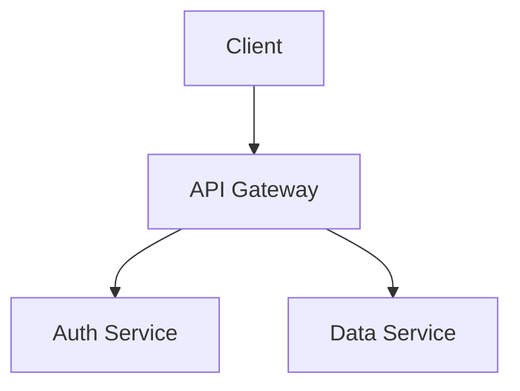

Create comprehensive documentation for this project using the @writer agent.

## Execution

### 1. Analyze Project

Before spawning the writer, gather context:

```bash
# Project type and dependencies
cat package.json 2>/dev/null || cat Cargo.toml 2>/dev/null || cat go.mod 2>/dev/null || cat requirements.txt 2>/dev/null

# Existing documentation (use Glob tool: pattern "**/*.md")
ls *.md 2>/dev/null

# Project structure
ls -la src/ 2>/dev/null || ls -la lib/ 2>/dev/null || ls -la
```

### 2. Spawn Writer Agent

Launch a single @writer agent with WRITE_MODE:

```
Task: writer
Prompt: |
  Create comprehensive documentation for this project.

  MODE: WRITE_MODE

  Focus on:
  1. README.md — Complete developer guide (quick start, architecture, API, config, development)
  2. Only create additional docs if README would exceed 500 lines

  Requirements:
  - Read actual code before documenting
  - All commands must be copy-paste ready
  - All examples must be verified against code
  - Consolidate into as few files as possible

  Project context:
  [Include gathered context from step 1]
```

### 3. Verification

After @writer completes:

```bash
# Show created/updated docs
git status --porcelain | grep -E '\.md$'

# Verify README exists and has content
wc -l README.md
head -50 README.md
```

## Output Format

### Documentation Created

| File | Lines | Sections |
|------|-------|----------|
| README.md | N | Quick start, Architecture, API, Config, Development |

### Summary

Brief description of what was documented and any gaps that couldn't be filled.

## Architecture Diagrams

For non-trivial projects, include architecture diagrams using Mermaid:

### When to Include Diagrams

- Projects with 3+ interconnected components
- APIs with complex request flows
- State machines or multi-step workflows
- Plugin/extension architectures

### Diagram Types

Use `/state-diagram` skill for:
- Component state machines
- User flow diagrams
- Request/response flows

Or create inline Mermaid diagrams:

```markdown
## Architecture


```

### Maintaining Diagrams

When updating docs:
1. Check if existing diagrams match current architecture
2. Update diagrams before prose (diagrams catch structural changes)
3. Remove diagrams for deleted components

## Notes

- Prefer updating existing README over creating new files
- If user specifies a particular doc type (API docs, architecture doc), focus on that
- Don't create documentation for trivial projects (< 5 files)
- Include architecture diagrams for complex projects
