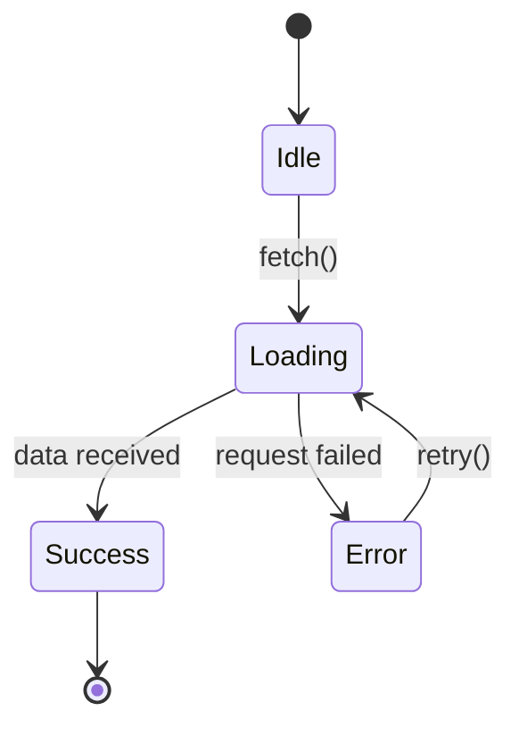
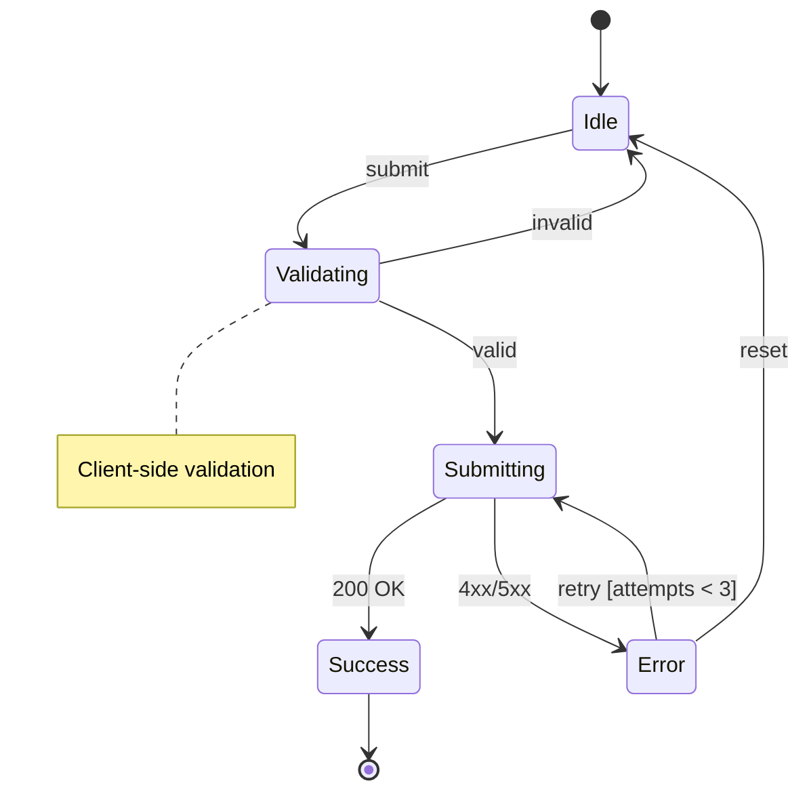
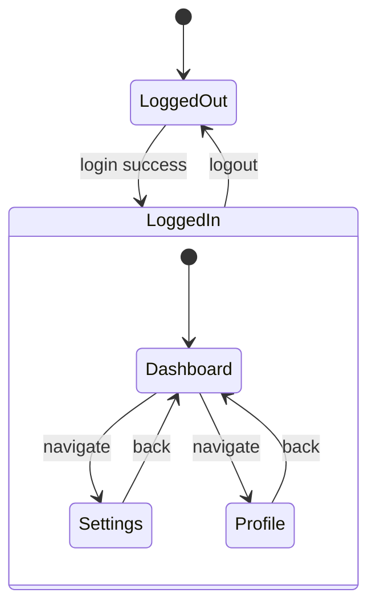
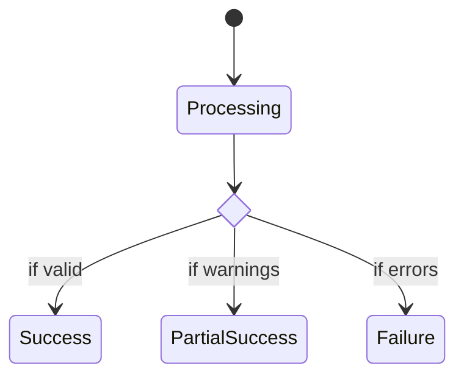
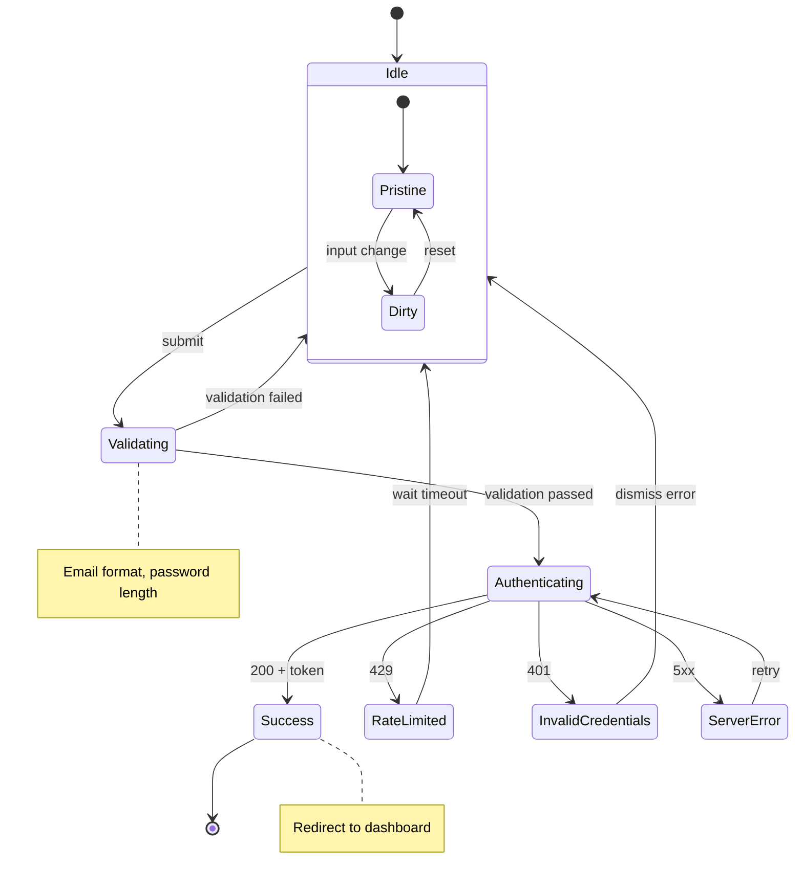

# State Diagram Generator

Generate exhaustive Mermaid state machine diagrams for components and update existing documentation.

## Purpose

- **Force exhaustive mapping** - Document EVERY state and transition, no lazy shortcuts
- **Verify correctness** - Understand behavior at a systems level before making changes
- **Create documentation** - Update existing docs as a side effect of analysis
- **Enable agent use** - Agents can invoke this skill to understand components before modification

## Analysis Methodology

### 1. Identify All State

Look for state in all forms:
- `useState`, `useReducer` hooks
- XState/state machine libraries
- Class component `this.state`
- URL/query parameter state
- Form state (controlled/uncontrolled)
- Ref-based state that affects behavior
- Implicit states (idle, pristine, touched, etc.)

### 2. Map Every Transition

For each state change, document:
- **Trigger**: What causes the transition (user action, async result, timer, effect)
- **Guard**: Conditions that must be true for transition to occur
- **Source → Target**: Which state it moves from/to
- **Side effects**: What else happens (API calls, analytics, cleanup)

### 3. Trace All Paths

Follow every possible path through the component:
- Happy path (normal user flow)
- Error paths (failures, validation errors)
- Edge cases (empty states, loading states, race conditions)
- Recovery paths (retry, reset, back navigation)

## Mermaid Syntax Reference

### Basic State Diagram



### With Notes and Guards



### Composite States (Nested)



### Choice Nodes (Conditional)



## Documentation Update Rules

**Priority order** (update existing, avoid creating new files):

### 1. README.md
If exists, add or update an `## Architecture` or `## State Machine` section:
```markdown
## Architecture

### Component State Machine

\`\`\`mermaid
stateDiagram-v2
    ...
\`\`\`
```

### 2. ARCHITECTURE.md
If exists, add a dedicated section with the full diagram and transition table:
```markdown
## [ComponentName] State Machine

### States
| State | Description |
|-------|-------------|
| Idle | Initial state, waiting for user action |
| Loading | Fetching data from API |
...

### Transitions
| From | To | Trigger | Guard |
|------|-----|---------|-------|
| Idle | Loading | fetch() | - |
...

### Diagram
\`\`\`mermaid
...
\`\`\`
```

### 3. Inline Comments
Add JSDoc or block comment in the component file:
```typescript
/**
 * LoginForm State Machine
 *
 * ```mermaid
 * stateDiagram-v2
 *     [*] --> Idle
 *     Idle --> Submitting : submit
 *     Submitting --> Success : 200
 *     Submitting --> Error : 4xx
 * ```
 */
```

### 4. Create New Doc (Last Resort)
Only if no existing docs and component is complex enough to warrant dedicated documentation.

## Quality Checklist

Before finalizing the diagram, verify:

- [ ] **Every state identified** - Including implicit states (idle, pristine, dirty)
- [ ] **Every transition mapped** - With trigger event labeled
- [ ] **Error states included** - What happens when things fail?
- [ ] **Initial state marked** - `[*] --> InitialState`
- [ ] **Terminal states marked** - `FinalState --> [*]` (if applicable)
- [ ] **Guard conditions noted** - `[condition]` syntax for conditional transitions
- [ ] **Side effects documented** - Notes for important actions

## Example Output

For a login form component:



**Files updated:**
- `README.md` - Added Architecture section
- `src/components/LoginForm.tsx` - Added inline JSDoc diagram
