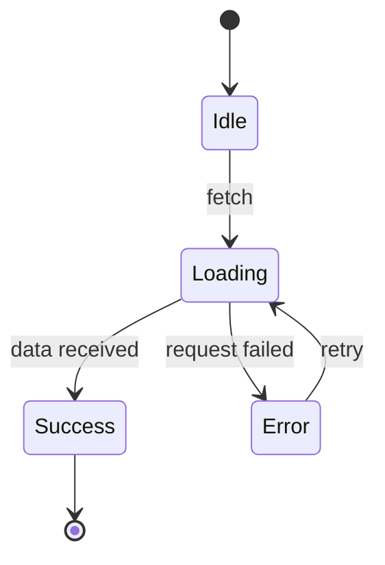
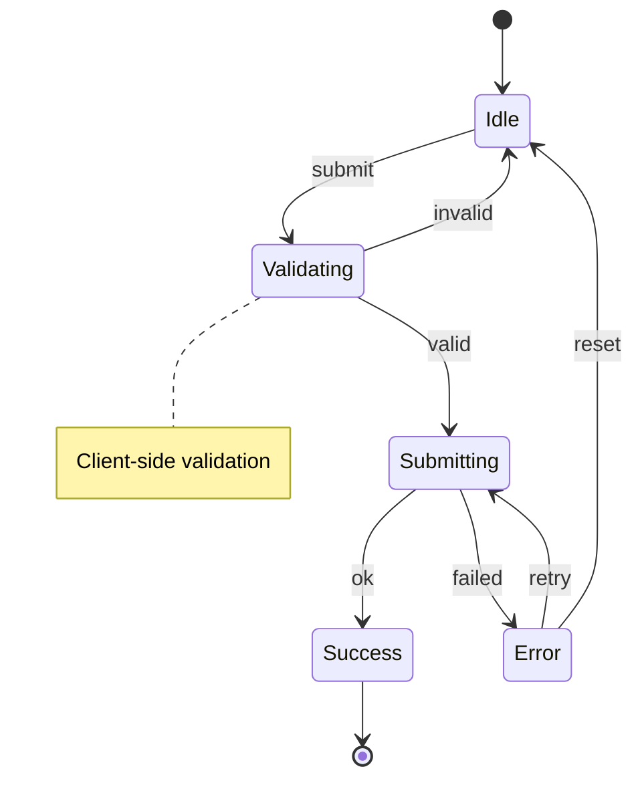
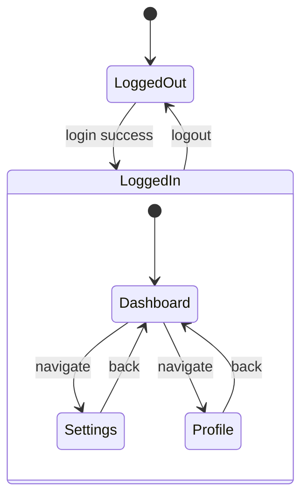
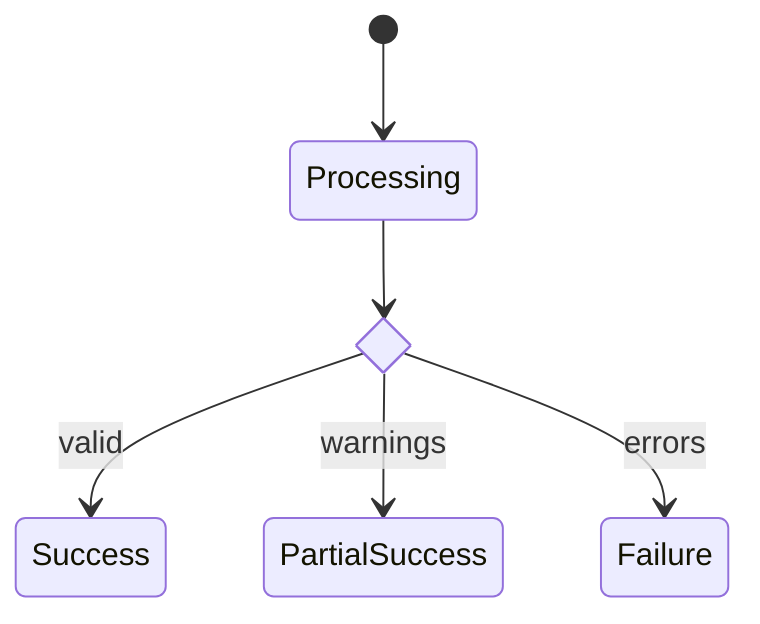
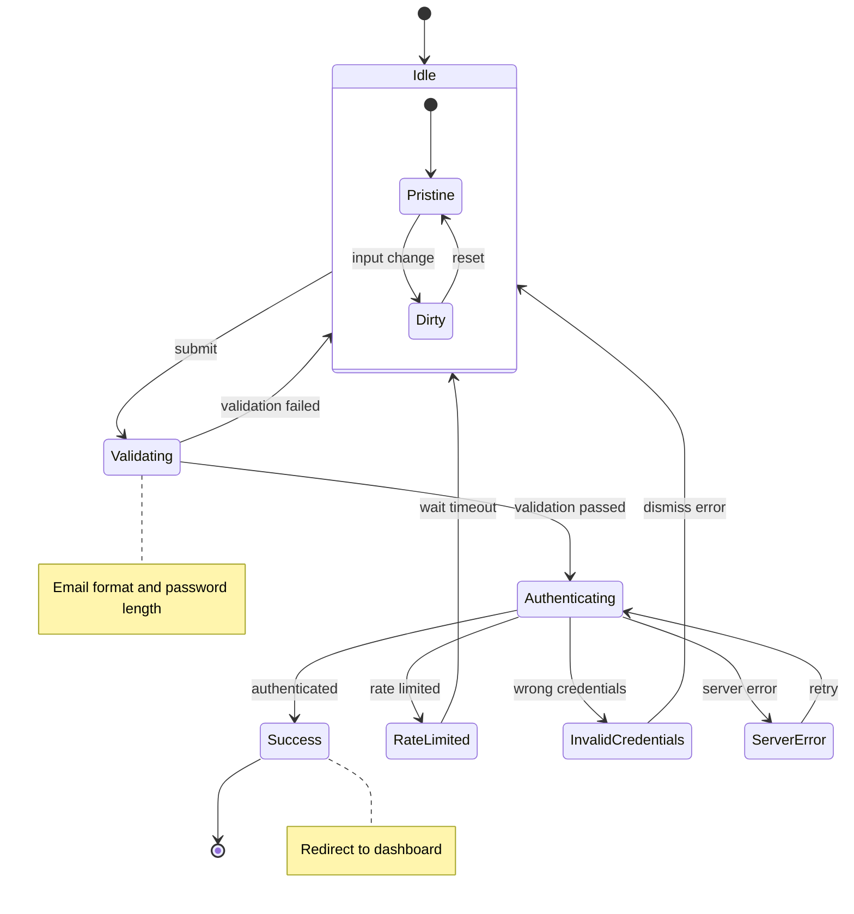

# State Diagram Generator

Generate exhaustive Mermaid state machine diagrams for components and update existing documentation.

## Purpose

- **Force exhaustive mapping** - Document EVERY state and transition, no lazy shortcuts
- **Verify correctness** - Understand behavior at a systems level before making changes
- **Create documentation** - Update existing docs as a side effect of analysis
- **Enable agent use** - Agents can invoke this skill to understand components before modification

## Analysis Methodology

### 1. Identify All State

Look for state in all forms:
- `useState`, `useReducer` hooks
- XState/state machine libraries
- Class component `this.state`
- URL/query parameter state
- Form state (controlled/uncontrolled)
- Ref-based state that affects behavior
- Implicit states (idle, pristine, touched, etc.)

### 2. Map Every Transition

For each state change, document:
- **Trigger**: What causes the transition (user action, async result, timer, effect)
- **Guard**: Conditions that must be true for transition to occur
- **Source → Target**: Which state it moves from/to
- **Side effects**: What else happens (API calls, analytics, cleanup)

### 3. Trace All Paths

Follow every possible path through the component:
- Happy path (normal user flow)
- Error paths (failures, validation errors)
- Edge cases (empty states, loading states, race conditions)
- Recovery paths (retry, reset, back navigation)

## Mermaid Syntax Rules

### CRITICAL: GitHub-Safe Labels

GitHub's Mermaid parser is strict. **Transition labels must be simple text only.**

#### Forbidden Characters in Labels

These characters WILL break rendering:

| Character | Example (BAD) | Why It Breaks |
|-----------|---------------|---------------|
| `=` | `status = approved` | Assignment/comparison syntax |
| `==`, `!=` | `type == "run"` | Comparison operators |
| `>=`, `<=` | `count >= 3` | Comparison operators |
| `/` | `POST /api/chat` | Path separators |
| `{`, `}` | `{id}`, `{user}` | Template syntax |
| `@` | `@mention` | Special character |
| `()` | `fetch()`, `run()` | Method call syntax |
| `.` | `user.save()` | Property access |
| `:` (extra) | `key: value` | Only one colon allowed (the label separator) |
| `,` | `a, b, c` | List separator |
| `"`, `'` | `type == "run"` | Quotes |
| `<`, `>` | `count > 0` | Comparison/HTML |
| `&` | `a & b` | Boolean/HTML entity |
| `|` | `a | b` | Boolean/pipe |

#### Safe Label Patterns

Use simple, human-readable phrases:

| Instead of (BAD) | Use (GOOD) |
|------------------|------------|
| `type == "run"` | `run action` |
| `POST /api/chat` | `send message` |
| `exitCode == 0` | `success` |
| `status = approved` | `approved` |
| `user.save()` | `save user` |
| `fetch()` | `fetch` |
| `count >= 3` | `limit reached` |
| `response.ok` | `ok response` |
| `action.type === "SUBMIT"` | `submit` |
| `attempts < maxRetries` | `can retry` |

#### Where Technical Details Go

Move technical details to accompanying tables, NOT diagram labels:

```markdown
### Transitions

| From | To | Label | Technical Trigger |
|------|-----|-------|-------------------|
| Idle | Loading | fetch | `fetch()` called |
| Loading | Success | success | `response.status === 200` |
| Loading | Error | error | `response.status >= 400` |
| Pending | Approved | approved | `POST /approvals/{id}` with `status=approved` |
```

### Basic State Diagram



### With Notes and Guards



**Note:** Guard conditions like `[attempts < 3]` break GitHub rendering. Document guards in a table instead.

### Composite States (Nested)



### Choice Nodes (Conditional)



**Note:** Use simple labels like `valid` instead of `if valid` - the choice node already implies conditionality.

## Documentation Update Rules

**Priority order** (update existing, avoid creating new files):

### 1. README.md
If exists, add or update an `## Architecture` or `## State Machine` section:
```markdown
## Architecture

### Component State Machine

\`\`\`mermaid
stateDiagram-v2
    ...
\`\`\`
```

### 2. ARCHITECTURE.md
If exists, add a dedicated section with the full diagram and transition table:
```markdown
## [ComponentName] State Machine

### States
| State | Description |
|-------|-------------|
| Idle | Initial state, waiting for user action |
| Loading | Fetching data from API |
...

### Transitions
| From | To | Label | Technical Trigger | Guard |
|------|-----|-------|-------------------|-------|
| Idle | Loading | fetch | `fetch()` called | - |
| Loading | Success | success | `response.status === 200` | - |
| Error | Loading | retry | `retry()` called | `attempts < maxRetries` |
...

### Diagram
\`\`\`mermaid
stateDiagram-v2
    [*] --> Idle
    Idle --> Loading : fetch
    Loading --> Success : success
    Loading --> Error : failed
    Error --> Loading : retry
\`\`\`
```

**Key:** The diagram uses simple labels; the table contains technical details.

### 3. Inline Comments
Add JSDoc or block comment in the component file:
```typescript
/**
 * LoginForm State Machine
 *
 * ```mermaid
 * stateDiagram-v2
 *     [*] --> Idle
 *     Idle --> Submitting : submit
 *     Submitting --> Success : 200
 *     Submitting --> Error : 4xx
 * ```
 */
```

### 4. Create New Doc (Last Resort)
Only if no existing docs and component is complex enough to warrant dedicated documentation.

## Quality Checklist

Before finalizing the diagram, verify:

- [ ] **Every state identified** - Including implicit states (idle, pristine, dirty)
- [ ] **Every transition mapped** - With simple human-readable labels
- [ ] **Error states included** - What happens when things fail?
- [ ] **Initial state marked** - `[*] --> InitialState`
- [ ] **Terminal states marked** - `FinalState --> [*]` (if applicable)
- [ ] **No forbidden characters** - Labels use only simple text (see Forbidden Characters table)
- [ ] **Technical details in table** - API paths, operators, method names go in transitions table
- [ ] **Side effects documented** - Notes for important actions (no special chars in notes either)

## Example Output

For a login form component:



### Accompanying Transitions Table

| From | To | Label | Technical Detail |
|------|-----|-------|------------------|
| Authenticating | Success | authenticated | HTTP 200 with token |
| Authenticating | RateLimited | rate limited | HTTP 429 |
| Authenticating | InvalidCredentials | wrong credentials | HTTP 401 |
| Authenticating | ServerError | server error | HTTP 5xx |

**Files updated:**
- `README.md` - Added Architecture section with diagram and transitions table
- `src/components/LoginForm.tsx` - Added inline JSDoc diagram
