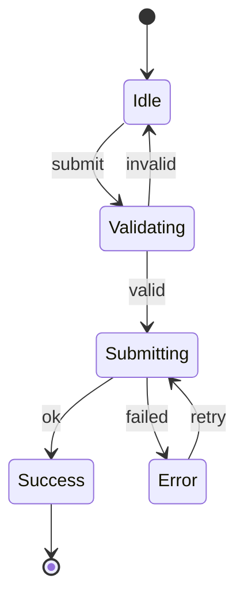

# State Diagram Generator

Analyze a component's states and transitions, then generate a diagram in the user's preferred format.

## Step 1: Ask Format Preference

Before generating, ask the user:

```
AskUserQuestion:
  question: "What format for the state diagram?"
  header: "Format"
  options:
    - label: "ASCII (Recommended)"
      description: "Simple text diagram, works everywhere, no rendering issues"
    - label: "Mermaid"
      description: "Renders in GitHub/docs, but has syntax restrictions"
    - label: "Markdown table"
      description: "Just the states and transitions as a table"
```

## Step 2: Analyze the Component

Identify all state:
- React: `useState`, `useReducer`, XState
- URL/query parameters
- Form state (pristine, dirty, touched)
- Implicit states (idle, loading, error, success)

Map every transition:
- **Trigger**: What causes it (user action, async result, timer)
- **Guard**: Conditions that must be true
- **Source → Target**: State change
- **Side effects**: API calls, analytics, cleanup

Trace all paths:
- Happy path
- Error paths
- Edge cases (empty, loading, race conditions)
- Recovery paths (retry, reset)

## Step 3: Generate Diagram

### ASCII Format

Simple, reliable, works everywhere:

```
                    submit
[Idle] ─────────────────────────> [Validating]
  ^                                    │
  │                              ┌─────┴─────┐
  │                            valid      invalid
  │                              │           │
  │                              v           │
  │                         [Submitting]     │
  │                              │           │
  │                        ┌─────┴─────┐     │
  │                     success     error    │
  │                        │           │     │
  │                        v           v     │
  │                   [Success]    [Error]   │
  │                                    │     │
  │                               retry│     │
  │                                    │     │
  └────────────────────────────────────┴─────┘
```

Or simpler arrow notation:

```
[Idle] --submit--> [Validating] --valid--> [Submitting] --success--> [Done]
                        |                       |
                     invalid                  error
                        |                       |
                        v                       v
                     [Idle]                  [Error] --retry--> [Submitting]
```

### Mermaid Format

Only if user selects Mermaid. Keep labels simple (no special characters):



**Mermaid restrictions** (if needed):
- No `=`, `==`, `!=`, `>=`, `<=` in labels
- No `/`, `()`, `.`, `{}`, quotes
- Use simple words: "submit" not "form.submit()"

### Table Format

| State | Transitions Out | Trigger | Next State |
|-------|-----------------|---------|------------|
| Idle | submit | User clicks submit | Validating |
| Validating | valid | Passes validation | Submitting |
| Validating | invalid | Fails validation | Idle |
| Submitting | success | HTTP 200 | Success |
| Submitting | error | HTTP 4xx/5xx | Error |
| Error | retry | User clicks retry | Submitting |

## Step 4: Update Documentation

If updating existing docs:
1. Add to README.md under `## Architecture` section
2. Or add to ARCHITECTURE.md if it exists
3. Or add as JSDoc comment in the component file

Only create new documentation files if explicitly requested.

## Quality Checklist

- [ ] Every state identified (including implicit: idle, loading, error)
- [ ] Every transition mapped with trigger
- [ ] Error states and recovery paths included
- [ ] Initial and terminal states marked
- [ ] Format matches user preference
